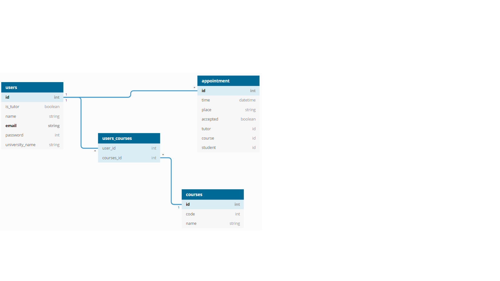
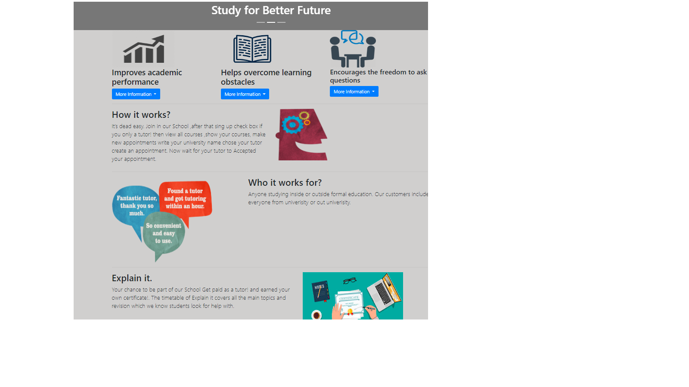

# Project-name- Explain_it:

## We believe that a great tutor does more than just teach.

# What this project about?:

When can we say we  have a problem? Will we can not just say this is a problem or that a problem without proving it!.
My life as a student  I had seen almost all students having a real problem which is understanding the course.Some of them feel shy, afraid, don’t know how to ask a teacher about the course if they don’t understand some of it. I have asked many students  a question  when students  can’t understand what a teacher saying in the class what would you do ?. 15% of students says that we go to the  office hour, 5% says if we don’t  find  a privet teacher we withdraw from class, 5% of student says we go to the office hour if we still not understand we will go to privet teacher. 10% says looking at Google and YouTube. Now here is my proof that we having a real problem ! **65% of students say going to privet teachers!** going to privet teachers will cost a lot of money !. So, I came up with Explain_it. Explain_it  is a website that students who got B+ and above become tutors for other students to help them improve and becomes more comfortable, confident …etc.

 # Database Relations:

 

 # Website Homepage Img:

 

### Website Homepage link:
* [Click here to visit the website!](https://explan-it.herokuapp.com/) 

## Requirements Met:

### General Requirements:

- [x] Build a web application from scratch, must be your own work. 
- [x] Use Ruby on Rails framework to build your application 
- [x] Don't use Rails Scaffolding for generating your resources. 
- [x] Deploy on Heroku so application is live on the web 
- [x] Craft a `README.md` file that explains your app to the world 

### Technical Requirements:

#### Authentication:
- [x] User must be able to sign up 
- [x] User must be able to sign in 
- [x] User must be able to sign out
- [x] User must be able to change password 

### Database Relations website:

* [Click here to visit the website!](https://dbdiagram.io/home) 
